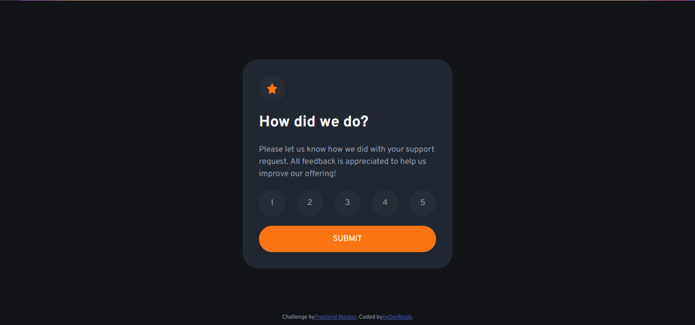

# Frontend Mentor - Interactive rating component solution

This is a solution to the [Interactive rating component challenge on Frontend Mentor](https://www.frontendmentor.io/challenges/interactive-rating-component-koxpeBUmI). Frontend Mentor challenges help you improve your coding skills by building realistic projects.

## Table of contents

-   [Overview](#overview)
    -   [The challenge](#the-challenge)
    -   [Screenshot](#screenshot)
    -   [Links](#links)
-   [My process](#my-process)
    -   [Built with](#built-with)
    -   [What I learned](#what-i-learned)
    -   [Continued development](#continued-development)
    -   [Useful resources](#useful-resources)
-   [Author](#author)

## Overview

### The challenge

Users should be able to:

-   View the optimal layout for the app depending on their device's screen size
-   See hover states for all interactive elements on the page
-   Select and submit a number rating
-   See the "Thank you" card state after submitting a rating

### Screenshot

### Links

-   Solution URL: [Add solution URL here](https://your-solution-url.com)
-   Live Site URL: [Add live site URL here](https://your-live-site-url.com)

## My process

### Built with

-   Semantic HTML5 markup
-   CSS custom properties
-   Flexbox
-   Mobile-first workflow

This is an attempt to use Cube CSS metodology. It was probably unnecessary for a project as small as this but I hope it will be useful later.

### What I learned

I learned the ways to use flexbox as a versatile tool to create responsive layouts. For example, it was used to center stand-alone components with a utility class:

.center {
display: flex;
align-items: center;
justify-content: center;
}

I struggled trying to make circular components scale with the page. Eventually, I did it using viewport width units:

--circular-element: 11.2vw;

.circular {
width: min(52px, var(--circular-element));
height: min(52px, var(--circular-element));
border-radius: var(--border-radius-max);
}

However, I would like to know a cleaner way to do this.

### Continued development

The SVG icon seemed to behave quite unpredictably. This means I should learn more about using SVGs.

### Useful resources

-   https://www.youtube.com/kepowob - Kevin Powell's Youtube channel dedicated to CSS
-   https://cube.fyi/examples.html#talks-videos-and-interviews - about Cube CSS

## Author

-   Frontend Mentor - [@twDevNoob](https://www.frontendmentor.io/profile/twDevNoob)
